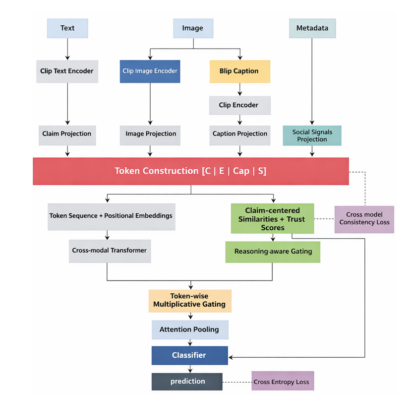

# ECRT

> **Evidence-Centric Cross-Modal Reasoning with Trust-Aware Gating for Multimodal Fake News Detection**

---

##  Overview

ECRT (Evidence-Centric Cross-Modal Reasoning with Trust-Aware Gating) is a novel transformer-based framework for multimodal fake news detection. Unlike conventional feature-fusion approaches, ECRT explicitly models the reliability of visual evidence through structured evidence-centric reasoning, trust-aware dynamic gating, and cross-modal consistency learning.

The framework jointly reasons over textual claims, visual evidence, caption-derived semantics, and social context to improve robustness, interpretability, and generalization across multimodal misinformation datasets.

---

##  Key Features

-  Evidence-Centric Cross-Modal Reasoning
-  Trust-Aware Dynamic Gating
-  Caption-Aligned Evidence Refinement
-  Cross-Modal Consistency Regularization
-  Transformer-Based Multimodal Fusion
-  Interpretable Evidence Weighting
-  Lightweight & Efficient Architecture

---

##  Architecture

  

The ECRT pipeline consists of:

1. CLIP Text Encoder
2. CLIP Vision Encoder
3. BLIP Caption Generator
4. Evidence Token Construction
5. Cross-Modal Transformer
6. Trust-Aware Gating Module
7. Attention Pooling
8. Classification Head
9. Cross-Modal Consistency Loss

---

##  Datasets

Experiments are conducted on:

- FakeDdit
- Weibo

Supported Tasks

- Binary Fake News Detection
- Three-Class Classification
- Six-Class Fine-Grained Classification

---

## Experimental Results

ECRT demonstrates strong performance across multiple benchmark datasets by introducing explicit evidence reasoning rather than relying solely on feature-level fusion.

Key advantages include:

- Improved Cross-Modal Alignment
- Adaptive Evidence Reliability Modeling
- Better Generalization
- Stable Training
- Interpretable Multimodal Reasoning

---

##  Applications

- Fake News Detection
- Multimodal Misinformation Detection
- Social Media Analysis
- Vision-Language Reasoning
- Trustworthy AI
- Explainable AI
- Cross-Modal Learning

---

##  Tech Stack

- Python
- PyTorch
- CLIP
- BLIP
- Transformer Encoder
- NumPy
- Pandas

---

##  Authors

**Meghna Gade**,**Sriman Narayana**

Indian Institute of Information Technology, Design and Manufacturing Jabalpur

---

##  Future Work

- Video Misinformation Detection
- Multimodal Retrieval-Augmented Verification
- LLM-Assisted Fact Verification
- Real-Time Social Media Monitoring
- Cross-Lingual Fake News Detection

---

## 📜 License

This repository is released under the MIT License.
